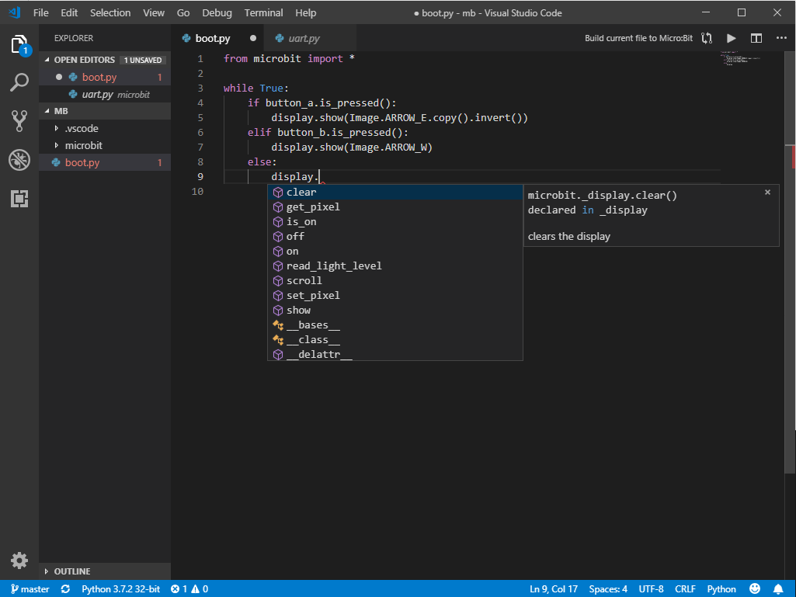
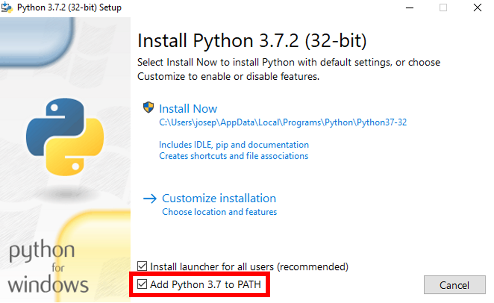
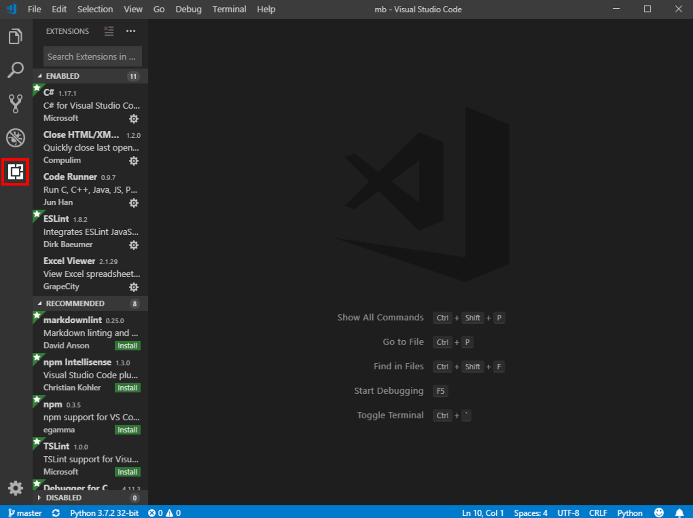
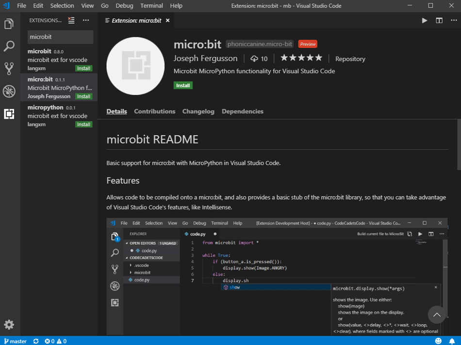
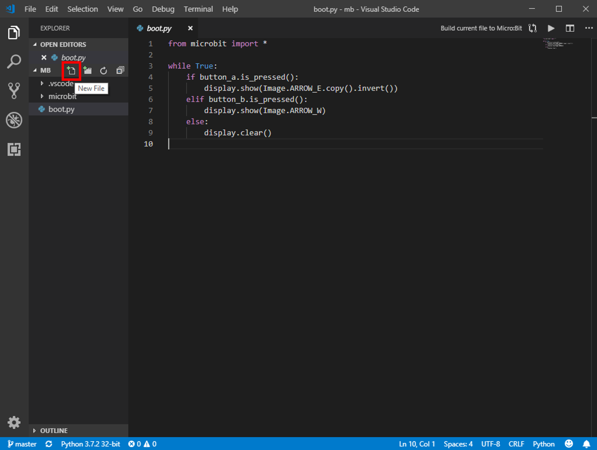

# Week 2 - Programming on a *real* micro:bit

## Part 1 - Integrated Development Environments

Throughout the rest of this course, we will be developing micro:bit code in an Integrated Development Environment (IDE). This means that we get cool features, such as code highlighting, code suggestions, and autocomplete. This should make it much more easy to understand when something is wrong, and why.



This is the IDE we will be using - Microsoft Visual Studio Code. It provides a number of features that we will use, that should make your lives easier. As we go through the course, we will talk about other aspects of development - such as GIT, but for now all you need to know is that Visual Studio Code is basically a text editor with extra features.

## Part 2 - installing everything

### Visual Studio Code

The first thing we need to install is our IDE - Visual Studio Code.

Please download it from here: https://code.visualstudio.com/, and install it. We will be using the latest stable release, which is downloadable with the big green button.

### Python and Pip

The next thing we need to install is Python, and this can go wrong in a number of ways, so it's pretty important that you follow the steps properly.

The installer for Python is located here: https://www.python.org/downloads/. Please make sure to download Python 3.7.2, which is available at the top of the page.

Install the program as you would any other program, but on Windows, make absolutely sure that you check the "Add Python to Path" checkbox, as seen below:



Once you have installed, open Command Prompt if you're on Windows, or Terminal if you're on Mac, or Bash if you're on Linux, and type the following:

`pip --version`

You should see something like the following show up in response:

`pip 18.1 from <installation location> (python 3.7)`

If you don't get something like this, and instead get something more like this:

`'pip' is not recognized as an internal or external command, operable program or batch file.`

Then there is an issue with either your Python installation, or your Pip installation, and it's likely that either Pip or both Python and Pip did not make it into your PATH.

Please ask for help if this happens.

### Uflash

So, your Python and Pip are both working, now we're in the home stretch. We need to install the application that writes your code to your microbit.

Open a terminal/command prompt/bash window, and type `pip install uflash`. This should complete with no errors.

Now, try typing `uflash x`. You should get an error back, saying: `Error flashing x to microbit: Python files must end in ".py".`. This means that everything is working perfectly.

### Git

Git is the final thing we need to install before we get into our IDE. First, check that you don't already have it, by typing `git --version` in your terminal. If you get something like this: `git version 2.9.2.windows.1`, you can skip onto the next step. Otherwise, please download git from here: https://git-scm.com/downloads.

Just go through the installation like normal, and once you're done, type `git --version` to check if the installation was successful.

### Microbit extension for Visual Studio Code

Now that we've got all the prerequisites installed, we can finish off by installing the micro:bit extension for Visual Studio Code.

1. Open Visual Studio Code
2. Click on the "Extensions" tab on the left: 
3. In the search bar at the top, search for "microbit", and select the extension titled: "micro:bit" 
4. Click the green "Install" button

## Part 3 - Programming for the micro:bit

1. Create a new folder where you would like to keep your microbit stuff.
2. Now, open Visual Studio Code, select "open folder" on the start screen, and select the folder you have just created.
3. Now, press `Control + Shift + P` if you are on Windows, or `Command + Shift + P` if you are on Mac to open the Command Palette.
4. Type `Fetch` into the Command Palette, and select `Fetch micro:bit modules`. This will add a new folder named `microbit` to your project folder. Don't worry about the contents of this folder.
5. Now, create a new file in your project folder, by pressing the new file button to the left of the IDE: 
6. Name the file anything, but put "`.py`" at the end.
7. Copy-paste this into the file:
    ```
    from microbit import *

    while True:
        if button_a.is_pressed():
            display.show(Image.ARROW_E)
        elif button_b.is_pressed():
            display.show(Image.ARROW_W)
        else:
            display.clear()
    ```
8. Plug your Micro:Bit into your computer, through USB.
9. Press "Build current file to Micro:Bit"
10. Wait until the orange light on the back stops flashing, then try pressing the buttons on the micro:bit. If pressing the buttons displays arrows, then everything has worked!
    
    Otherwise, please ask for help.

## Part 4 [Extension]

### Extension 1 - Moving pixels

Now that you've got everything set up, let's write some code. We're going to start simple, and write code that moves a pixel on the micro:bit's display when you press the two buttons. `B` should move the pixel left, and `A` should move it right.

Before that though we need to understand variables.

In Python, a variable is defined as follows:
```
<variable name> = <value>
```
We are going to store the image being displayed on the screen then change them with the variable.

Here is an example of a variable being used with the display:
```
from microbit import *

myImage = Image.ARROW_W

while True:
    if button_a.is_pressed():
        display.show(myImage.invert())
    elif button_b.is_pressed():
        display.show(myImage)
    else:
        display.clear()
```

Experiment with that a bit to understand how it works.

Now let's look at another important function - `Image.set_pixel(x,y,value)`

```
from microbit import *

myImage = Image()
myImage.set_pixel(2,2,9)

while True:
    if button_a.is_pressed():
        display.show(myImage.invert())
    elif button_b.is_pressed():
        display.show(myImage)
    else:
        display.clear()
```

Try running that code. What does it do? Once you've figured that out, try to write an application for the micro:bit, that moves a pixel when you press the buttons.

Once you've finished that, try to make it so that if you press `B`, while the pixel is on the leftmost edge of the display, it moves up to the rightmost edge of the row above.

Please let me know when you've completed all of this.